# Non-graphical ECOA Tools Architecture Document (TAD)

Copyright 2023 Dassault Aviation

MIT License (see LICENSE.txt)

## 1. Description of the toolkit software architecture

### 1.1 Toolkit overview

ECOA tools aim at facilitating ECOA system design and development.
The toolkit of non-graphical tools is composed of five tools : ASCTG,
CSMGVT, EXVT, LDP and MSCIGT.

MSCIGT and CSMGVT rely on a common package called ECOA-TOOLSET,
allowing to manipulate ECOA XML models.

### 1.2 COTS

COTS used in all tools : Python3.8, C/C++

COTS used in LDP : Cunit (Unit test), APR (system calls abstraction),
zlog (logging facility), C/C++ (ECOA framework library)

### 1.3 Configuration

All ECOA tools take an ECOA project description file as an input.

Other specific configuration options are available, for example:

- ASCTG also requires an ECOA configuration file specifying
  the components under test.
- EXVT can validate ECOA incomplete models, in accordance with the
  requested level of the validation (input parameter).
- MSCIGT can take an input template, specifying a customized file header
  style for code and header files.

Please see user documentation of each tool for further details.

### 1.4 Global architecture

#### 1.4.1 EXVT

EXVT is an ECOA model checker.

The ECOA project validation consists in the following steps:

- Project XML files parsing (with syntax checks using xsd validation)
- Build of an ECOA model.
- Consistency checks of ECOA model.
- Syntax checks.
- Legality rules checks (ECOA AS6 Part7 Metamodel).
- Consistency between ECOA XML files.
- Generation of a final report with the status of the validation. 

##### Class diagrams

###### Types

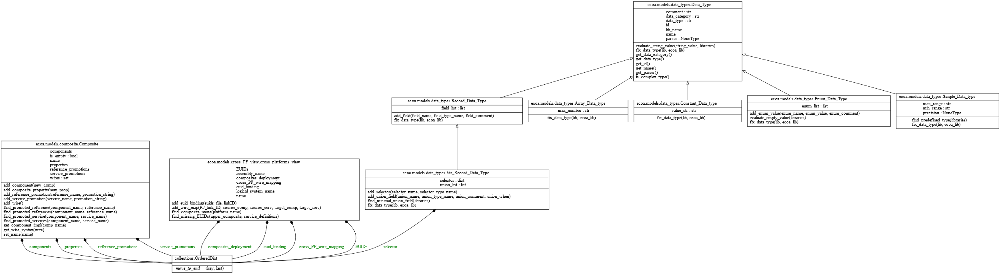

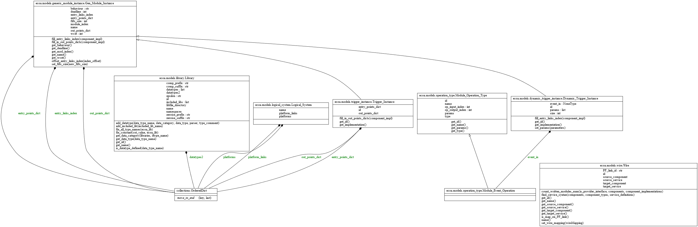

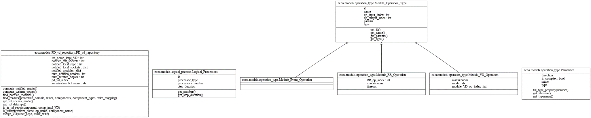

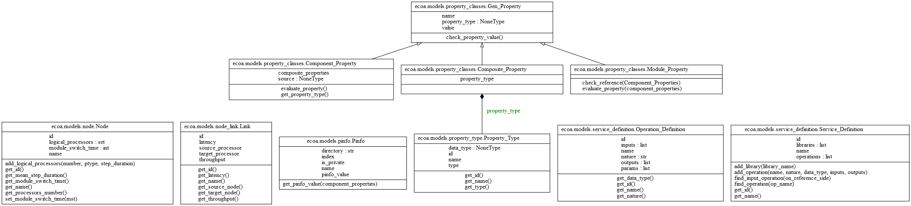

###### Components


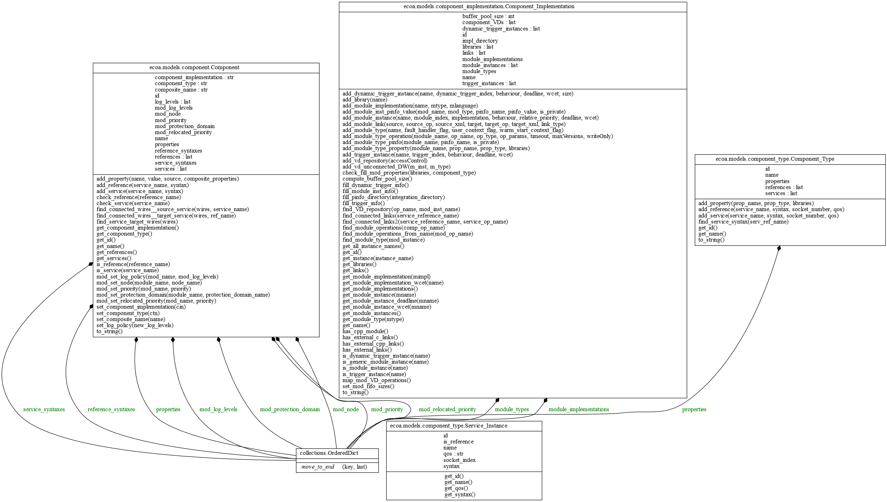

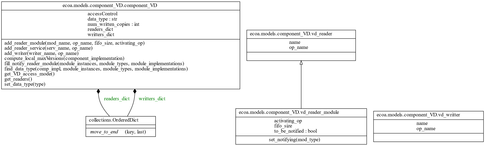


###### Modules

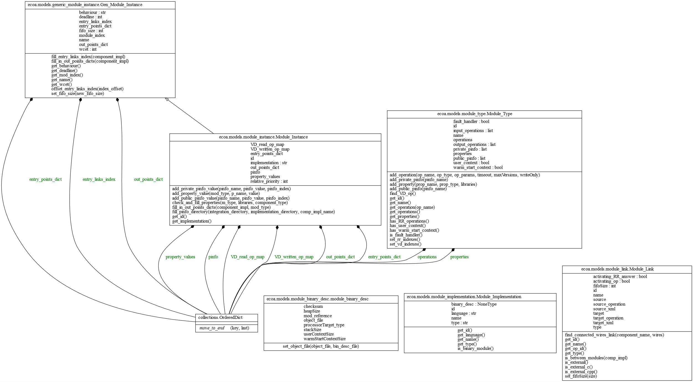

###### Platform/Protection domain

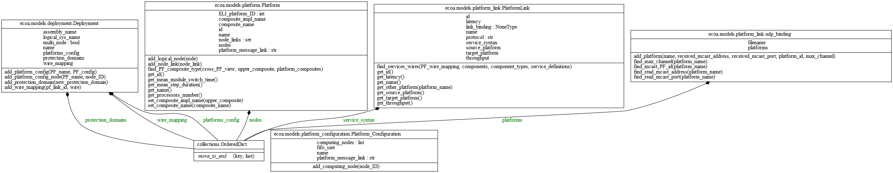

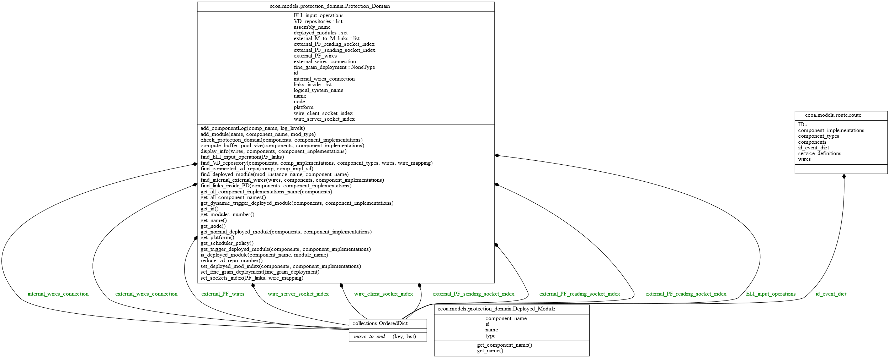

###### Parsers

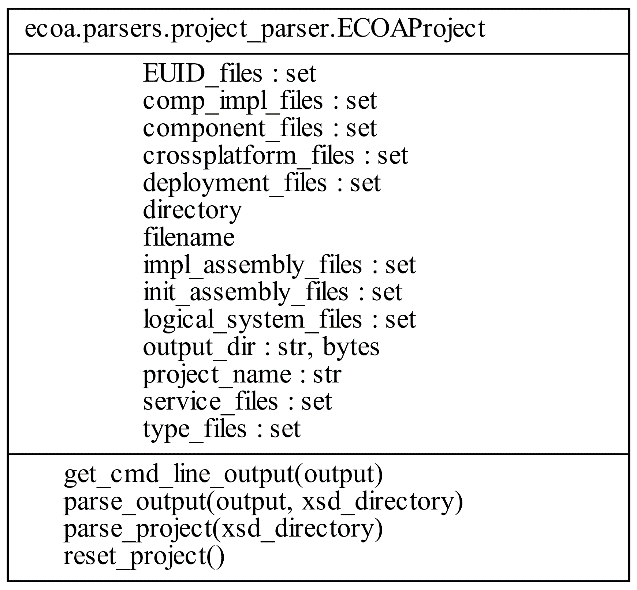

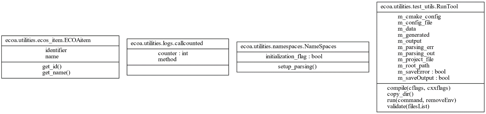


#### 1.4.2 ASCTG

The ASCTG is a HARNESS generator allowing the creation of HARNESS
replacing all components that are not under test.

By this way the content of the user components can be tested
independently from the rest of the application implementation.

The HARNESS generation is composed of the following steps:

- Project's XML files parsing and validation (using EXVT)
- Parsing of ASCTG config file (containing components under test)
- Generation of HARNESS files
- Creation of HARNESS component type
- Creation of HARNESS Component implementation file
- Update of ECOA project file (to handle new HARNESS files)
- Update of composite file (to add HARNESS component)
- Update of deployment file (to add HARNESS protection domain)

This generation leads to the following schema where A and B are the
components under test:

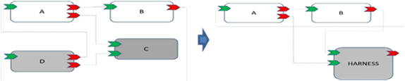

**Class diagram**

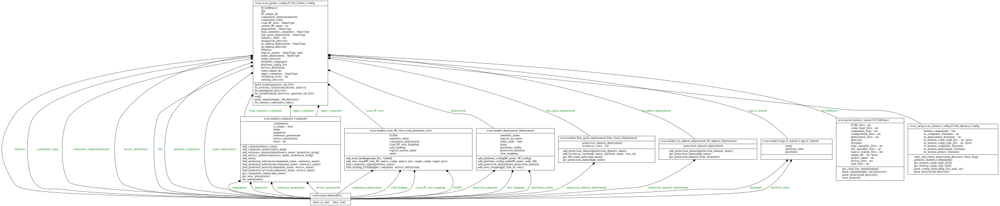


#### 1.4.3 LDP generator

The LDP tool is the ECOA application generator, it generates the entire source code (framework level source code) and CMakeList files required to compile and execute an ECOA application from an input ECOA project file compliant with the ECOA AS 6 description.

The LDP generation process is composed of the following steps:

- Project XML files parsing and validation (using EXVT)
- Building an internal ECOA model.
- Generation of application C/C++ source files and CMakeList files.

For the generation, using information stored in the ECOA model, the
tool generates for each ECOA folder the corresponding source files and
its associated CMakeList file.

The tool also generates the CMakeList and the code of the ECOA
framework library used by the ECOA application.

**Class diagrams**

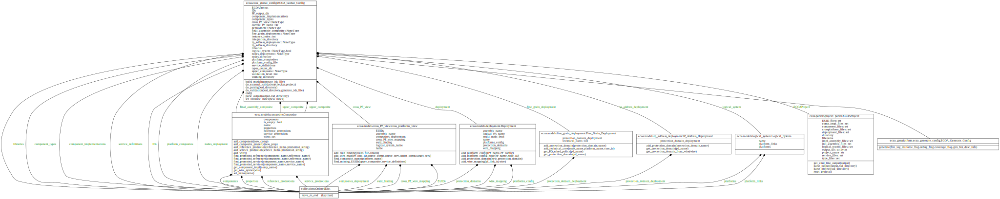


#### 1.4.4 ECOA-Toolset

The ECOA-TOOLSET is a directory grouping common functions to parse and generate an input ECOA project file.
It builds an internal ECOA model to generate skeleton source files for MSCIGT and a CSM for CSMGVT. 
The ecoa-toolset generates types, headers templates and entry points implementation.

##### 1.4.4.1 Generator

The generator directory groups all functions used to generate ECOA module and container mechanisms (event, request-response, pinfo, versioned data, time, logs), entry points, types.

**Types**

The types directory is used by CSMGVT and MSCIGT to generate, for a given project, all the libraries and their data types sorted by dependencies.

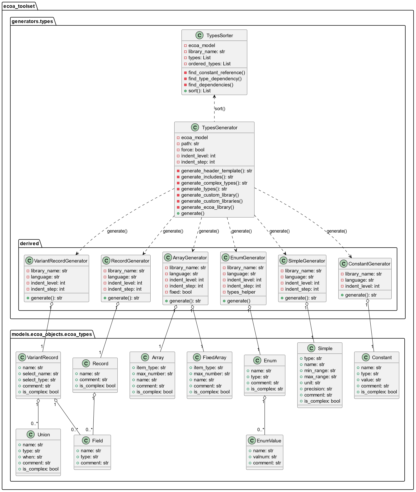

**Modules**

The module directory is used by MSCIGT to generate skeleton code in module source files and function declarations in module header files.

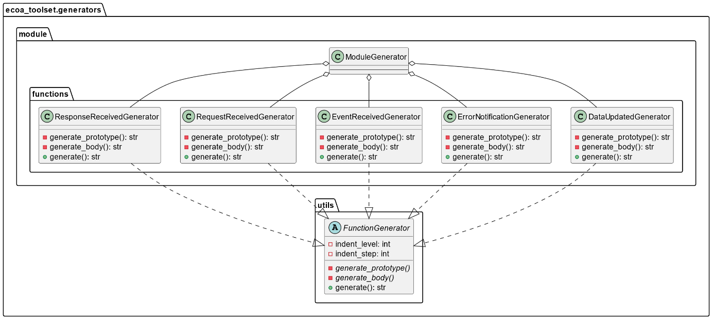

**Container**

The container directory is used by MSCIGT to generate function declarations in container header files and skeleton code in container mock files. 
It is also used by CSMGVT to generate implementation code in the CSM file, a mock containing container code implementation.

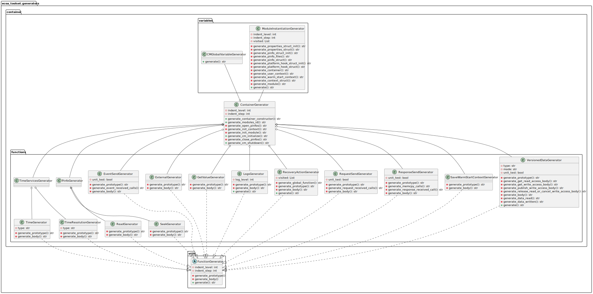

**Helpers**

Helpers are functions that performs part of the computation of another function following the DRY (Do not Repeat Yourself) concept. The helper directory is used for the build of the CSM (CSMVT) and the module unit tests (MSCIGT) to manipulate and handle the creation of:
- Global variable for the initialization of the module context and its ID, linked mechanisms ID and functional aspect that needs it (platform hook, event, request-response, versioned data, PINFO)
- Platform hook, a platform that handles module identification and mechanisms (properties, PINFO).
- Property values according to its type category.

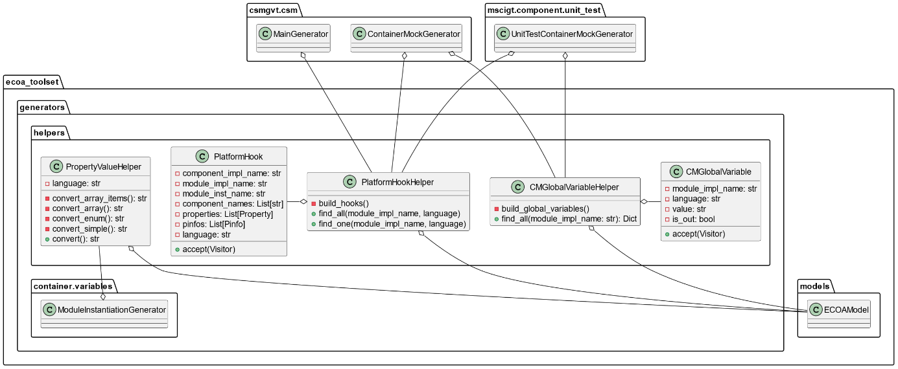


##### 1.4.4.2 Models

1) ECOA XML Model

The ecoa xml model python file contains the first class called to parse an ECOA project xml. It stores each attribute of the xml in corresponding directories that is used by the ecoa model python file.
This file uses the `ecoa_objects` directory to filter the desired fields of each attribute.

Types:


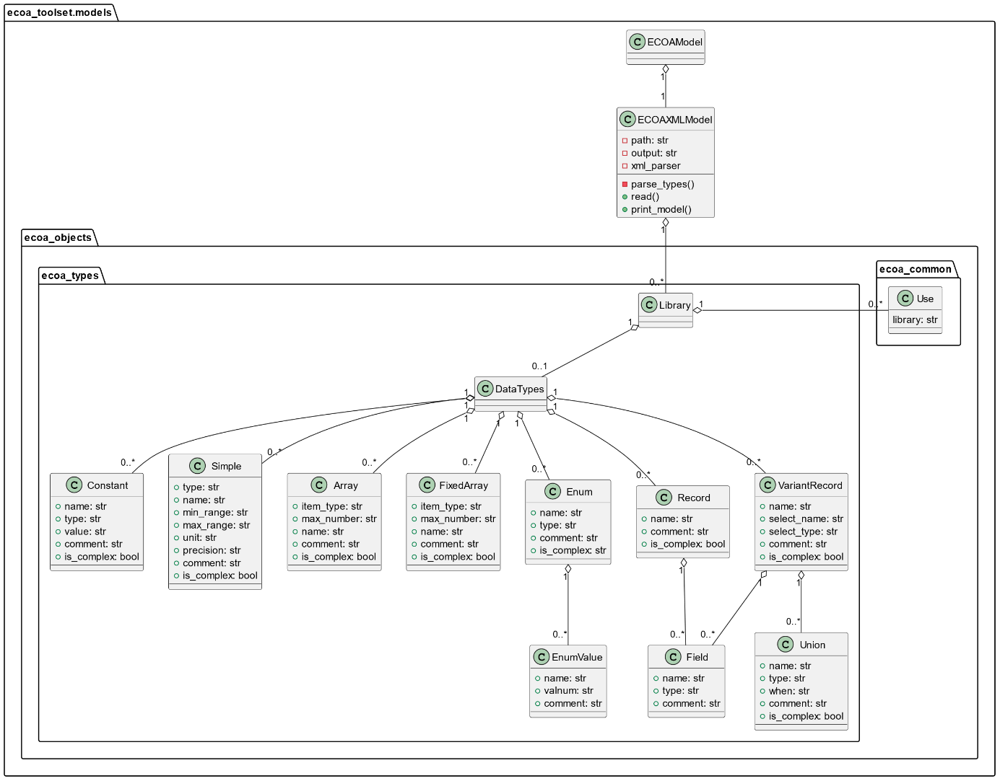


Deployment, Final assembly:

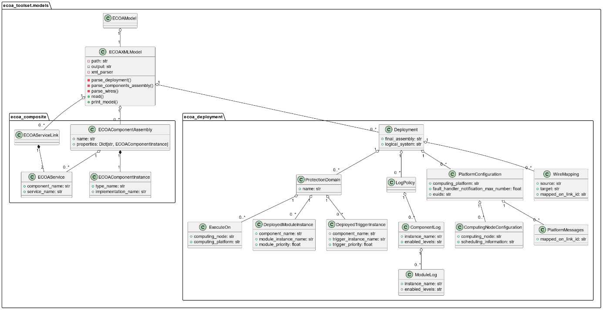


2) ECOA Model

The ecoa model python file is called to build an internal ECOA model based on the ECOA XML model. 
The goal of this model is to facilitate the manipulation of ECOA objects, by converting them, linking them when necessary and finally rearranging them in dictionaries for an easier access with a key system.

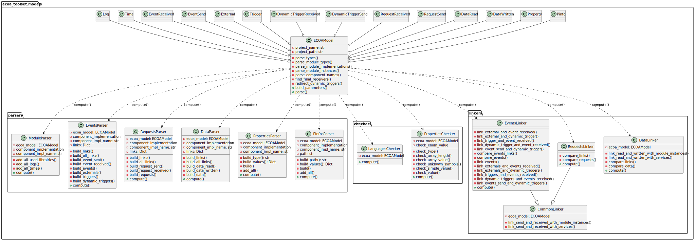

3) Components

Components are the base class of all ECOA operations. 
It allows the building of Variables, Log, Time, Trigger, DynamicTrigger, Event, Request-response, Versioned data, Property and PINFO objects. 
These objects are used by the visitor design pattern as elements to visit.


Data:


The DataRead and DataWritten objects are constructed by the DataParser
and linked by the DataLinker. 

A `DataRead` object has a dictionary called writers, where:

- Each key is in the form `#component_name#:#module_instance_name#`, where `#component_name#` and `#module_instance_name#` are respectively the name of the component and the name of the module instance which can handle this DataRead object
- Each value is another dictionary where:
	- Each key is in the form `#component_name#:#module_instance_name#`, where `#component_name#` and `#module_instance_name#` are respectively the name of the component and the name of the module instance manipulating which can handle a specific DataWritten object
	- Each value corresponds to the handled DataWritten object

A `DataWritten` has a dictionary called readers which is constructed according to the same logic.

These links made between readers and writers of a versioned data are useful when generating the routing implementation in versioned data container functions.

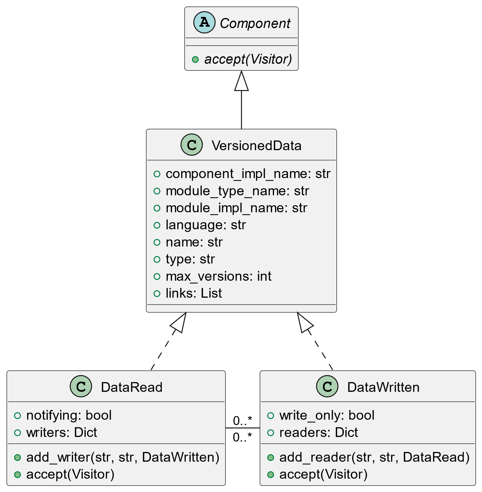


Event, Requests:


The EventSend, EventReceived, External, Trigger, DynamicTriggerSend and DynamicTriggerReceived objects are constructed by the EventsParser and linked by the EventsLinker. 
The RequestSend and RequestReceived objects are constructed by the RequestsParser and linked by the RequestsLinker.

These event and request objects have dictionaries (senders and receivers) constructed with the same logic as writers and readers dictionaries for data objects. 
These links made between senders and receivers are again useful when generating the routing implementation in event container functions and request-response container functions.

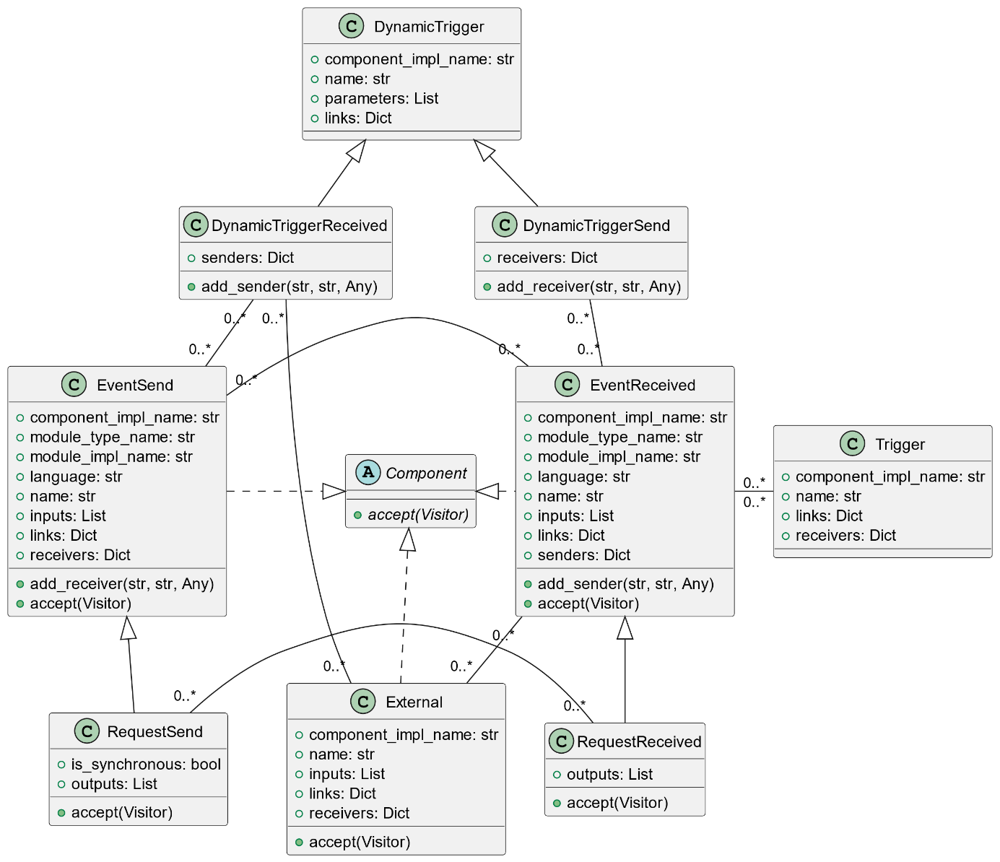


Log, Time, Variable, Property, PINFO:


The Log and Time objects are constructed by the ModuleParser. The PINFO object are constructed by the PinfosParser. 
The Property objects are constructed by the PropertiesParser and checked by the PropertiesChecker.

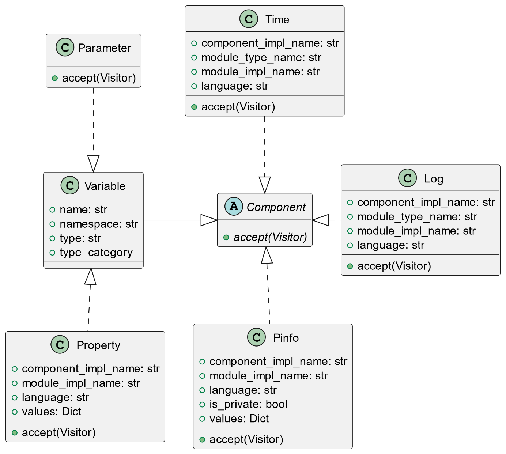


4) Helpers

- Helpers are functions that performs part of the computation of another function following the DRY (Don't Repeat Yourself) concept. The helper directory is used to search:
- A list of modules with some characteristics (`fault_handler`, `warm_start_context`).
- A list of ECOA model services comment according to its category (data, request-response, event).
- A dictionary of types according to its category (Array, constant, enum, fixedArray, simple, record, variantRecord, union) and build a namespace for a type.

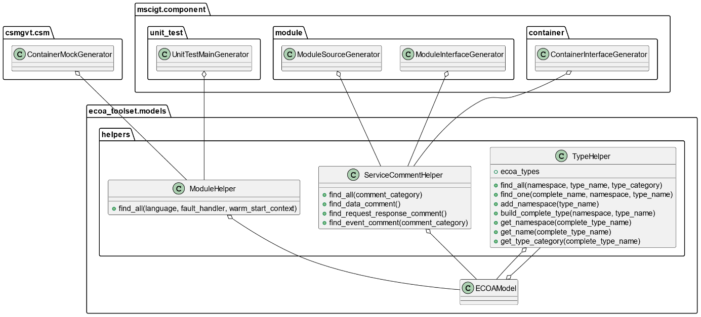

5) Visitors

Visitors are a behavioral design pattern that allows to separate the algorithm from an object structure on which it operates. 

It helps to add new features to an existing class hierarchy dynamically without changing it. Visitors are a way to handle communication between objects and work very well on recursive structures like trees or XML structures.

A Visitor method consist of two parts:

- A method named as visit() implemented by the visitor and used and called for every element of the data structure.
- A visitable class providing an accept() methods that accept a visitor

The following diagram illustrates the abstract visitor which sees his methods implemented by concrete visitors, which are themselves used by generators. 

Concrete elements that implement the acceptance method are the components (see above).

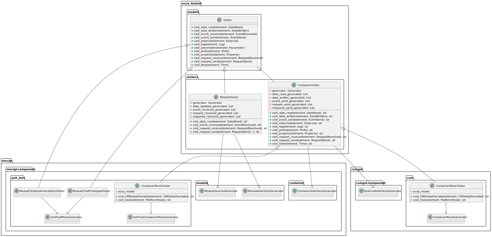


#### 1.4.5 MSCIGT

The MSCIGT generator generates the skeleton code of an ECOA application, described via an input ECOA project file.

The MSCIGT generation process is composed of the following steps:

- Project's XML files parsing and validation (using EXVT)
- Building an internal ECOA model (ecoa-toolset).
- Generation of skeleton C/C++ source and unit tests files. 

For the generation, using information stored in the ECOA model, the tool generates for each ECOA folder the corresponding source files and its associated unit tests.

The tool also generates the CMakeList for unit tests.

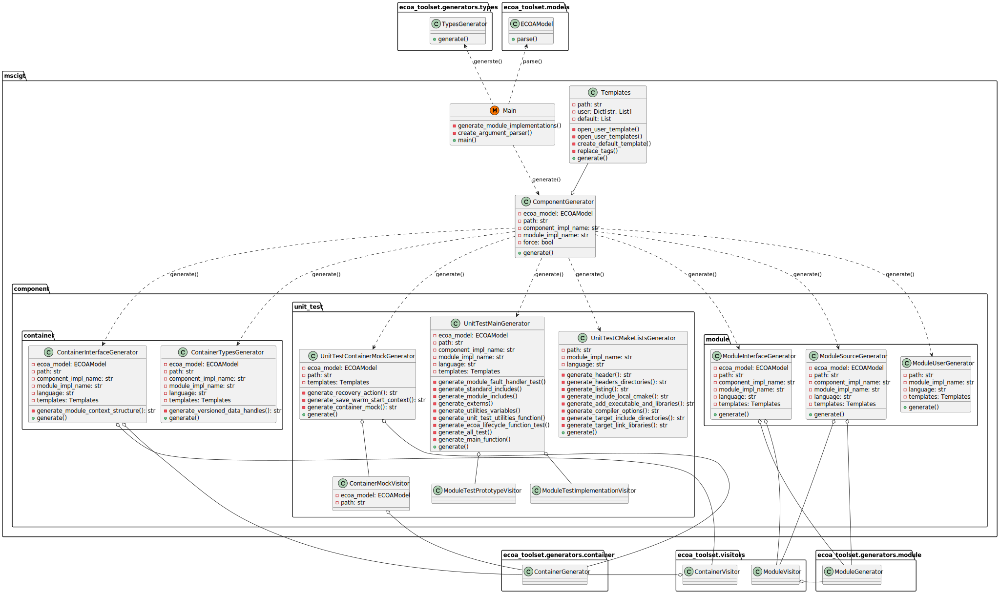


#### 1.4.6 CSMGVT

The CSMGVT tool is used to generate a CSM, a test environment without the ECOA middleware and the real time problem. 

It generates the container code and CMakeList files required to compile and execute an ECOA application from an input ECOA project file compliant with the ECOA AS 6 description.

The CSMGVT generation process is composed of the following steps:

- Project's XML files parsing and validation (using EXVT)
- Building an internal ECOA model (ecoa-toolset).
- Generation of a C/C++ CSM, a functional test environnement without the ECOA middleware and without real time problem, and CMakeList files.

For the generation, using information stored in the ECOA model, the tool generates an application mock of the ECOA framework and for each ECOA its associated CMakeList file.

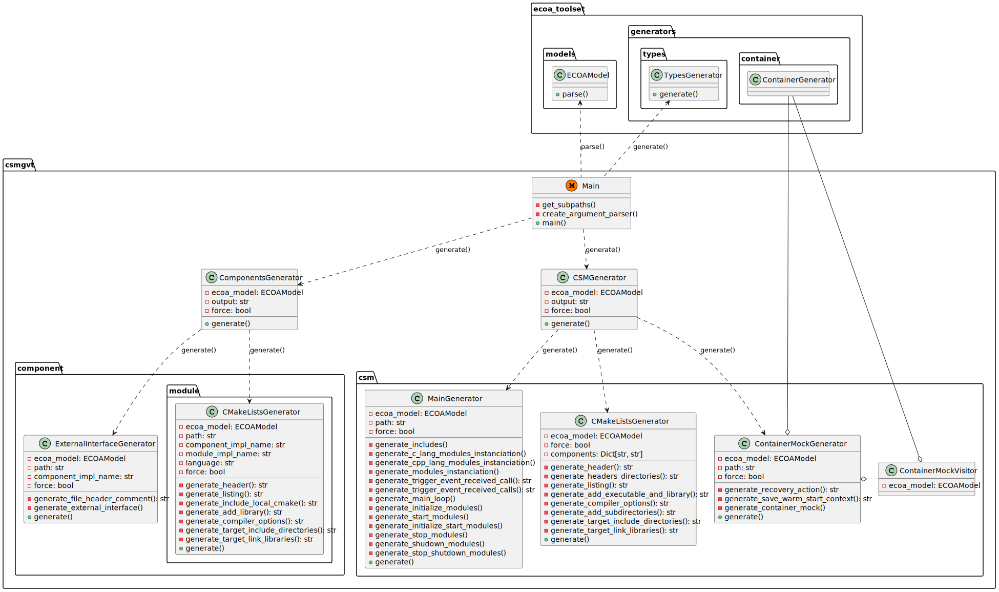


## 2. Software toolkit architecture between parts

### 2.1 Description of dataflow between tool parts

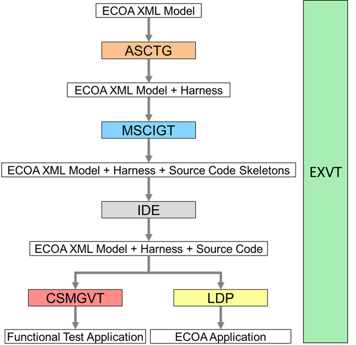

The workflow shows the link between tools. Each tools are connected but independent and must be run by the user. 
The tool can be run in a command line or with the help of an IHM in the `ecoa_ihm` folder.
An ECOA xml project is mandatory to run each tools. Relative or an absolute path can be given.

### 2.2 Description of the execution principles of the parts

#### 2.2.1 MSCIGT (allowing unit test execution)

When MSCIGT is run, the tool generates skeleton code source and for each modules, a unit tests folder. This folder is composed of a:

- `Cmakelists.txt` file, to build the unit test.
- `main.c` file, to run the lifecycle of modules instance.
- `module_container_mock.c` file, a mock similar to a CSM to create a test environment without the ECOA middleware and real time problem.

#### 2.2.2 CSMGVT (allowing CSM execution)

When CSMGVT is run, the tool generates a CSM file. This folder is composed of a:

- `Cmakelist` file, to build the CSM.
- `main.cpp` file, to run the lifecycle of modules instance.
- `CSM_project_name.cpp`, the mock container to create a test environment without the ECOA middleware and real time problem.
- Module folders with a Cmakelist to create library modules.

**Module details**

Each ECOA Module Instance (Trigger, or Dynamic Trigger) are sequentially executed, meaning that the notions of time and parallelism do not exist.
An ECOA Module Instance is defined by a context that contains among
others:

- A platform hook to handle technical datas (ID, properties, pinfos)
- A user context.
- A warm start context

All ECOA Module instance has at least 4 entry points for lifecycle operations:  INITIALIZE, START, STOP and SHUTDOWN. 

**Communication**

Communication managed in the CSM are exchanges between modules within the same component, and exchanges between modules from different components.

**Starting ECOA modules**

The main code consists in the following sequence:

- To initialize global variables in the CSM (platform hook, opening pinfo files).
- To initialize all modules
- To start all modules
- To activate triggers
- To stop all modules
- To shutdown all modules
- To shutdown global variables (opened file for pinfos)

The main file mocks the ECOA framework by using an infinite loop to call the entry points linked to the activation of modules.

**Versioned data**

The versioned data is represented by a two global variables in the
CSM:

- Data global variable
- Stamp global variable

Those global variables can be managed by three mechanisms:

- **Get_read**: this function copy the data of the global variable (data
  and stamp) in the `data_handle` given by the user when the function is
  called in the main.
- **Get_write**: this function works in two times, an initialization part
  of the `data_handle` given by the user if this is the first time the
  versioned data is called, and a write part where the data and stamp
  global variables are stored in the `data_handle` given by the user.
- **Publish_write**: this function is used to update the values in the
  `data_handle` given by the user in the data global variable.

**Pinfo**

Pinfos are managed via the platform hook by a global structure named
`pinfo_struct` in the CSM. This structure is built with:

- `Pinfo_index`: the position of the cursor in the file.
- `Pinfo_size`: the size of the file to read.
- `Pinfo_file`: the pinfo file.

All variables in this structure are initialized to 0 by default in the CSM. 

The `pinfo_file` is initialized according to the parameter file defined in the `csm_initialize` function, which is called from the main.

There are two operations to manage pinfos:

- **Read pinfo**: this function read the number of bytes, store it in the
  `memory_address` given by the user and store the number of bytes read
  in the `out_size` variable.
- **Seek pinfo**: this function places the cursor, store in the `new_position`, using the whence and offset given by the user.

#### 2.2.2 LDP 

##### 2.2.2.1 LDP platform architecture

###### 2.2.2.1.1 Global Architecture

LDP Platform is a multi-processed and multi-threaded application. The entry point of an LDP Platform is the main process that:
- Starts other processes (Protection Domain)
- Synchronizes the start of ECOA modules
- Detects child process failure
- Manages ELI starting sequence

In LDP Platform: 
- A Module Instance is an independent thread but can be optionally set to run with other modules on the same thread (see Optional Module Mapping).
- A Protection Domain is an independent process that contains:
	- A thread that reads sockets and routes messages to Deployed Module Instance (the router-thread).
	- A thread for each Deployed Module Instance or, if the option is activated, multiple Module Instances from different Components.
	- Some Modules could need other threads (i.e., Trigger Module,
      Module that sends Asynchronous Request Response, ...) 

Note: LDP Platform is based on POSIX threads (also known as pthread) for thread management and scheduling.

Note: Currently, all modules of a given component must be deployed in the same Protection Domain. 

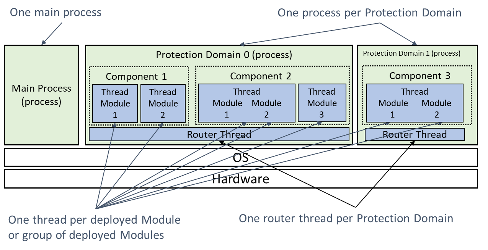

###### 2.2.2.1.2 Hardware characteristics

LDP is designed to be compliant with most of up-to-date PC hardware configurations.
See TOR for minimal hardware requirements.

###### 2.2.2.1.3 Protection Domain details

A Protection Domain is defined by a router thread and a context. The
context is a structure containing among others:

- The Protection Domain state. It is used at startup to synchronize the start of modules across all LDP Platform
- A structure to save information about Versioned Data operations 
- A Logger for technical messages.
- Contexts of all Modules Instance (Normal, Trigger, Dynamic Trigger)
- Structures to manage socket connections

The router thread manages the creation and the connection of sockets, the creation and the start of modules, the creation of Versioned Data Repository. 
It is also responsible for routing messages concerning modules to the right modules. The other messages should be consumed by the router-thread (Versioned Data updates, platform messages).

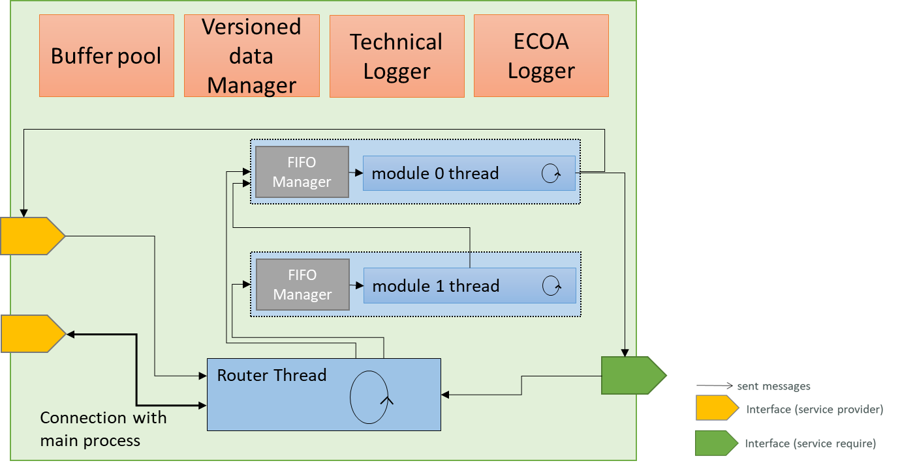

###### 2.2.2.1.4 Module details

**ECOA Module**

Each ECOA Module Instance (Normal, Trigger, or Dynamic Trigger) is either in an independent thread or group with other ECOA Modules (see Optional Module Mapping) and passively waits for a POSIX condition as long as its message FIFO is empty or without activating operations.

An ECOA Module Instance is defined by a context that contains among
others:

- The state of the module used for ECOA lifecycle
- A logger for module log messages.
- A FIFO manager that contains the FIFO. The FIFO contains pending messages that are consumed sequentially by the module thread following ECOA rules (see: FIFO manager).
- A structure named `operation_map` that contains information for operations that can be by the Module Instance.
- A buffer which contains message to send on socket or to read from socket.
- Module thread ID (unique on ECOA platform)

All ECOA Module instance has at least 4 entry points for lifecycle operations:  INITIALIZE, START, STOP and SHUTDOWN.

**Normal Module**

The context of Normal Module contains also:

- Properties structures that contain property values
- A structure that manages received or sent Request-Response
- A thread to manage outdated asynchronous Request-Response
- A structure that manages Versioned Data in read access 
- A structure that manages Versioned Data in write access


**Trigger Module**

In addition to an ECOA Module's context, the Trigger Module's context contains a structure that contains information about different periods and events to send.

Trigger Module has a special structure to handle multiple frequencies and to send events to multiple modules or interfaces (outside component). Like a normal module, a trigger module has a FIFO and a main thread that reads sequentially messages from FIFO. A Trigger Module has only the 4 entry points operations which are the lifecycle operations.

For each different period, Trigger Module creates:
- A POSIX timer controlled by the module main thread (start and stop)
- A thread receiving signals from the POSIX timer in order to send events.


**Dynamic Trigger Module**

The context of a Dynamic Trigger Module contains, in addition to the
ECOA Module context:

- A structure that contains information about different delays to wait and events to send.
- Minimal and maximal values of delays.

Dynamic Trigger Module has a special structure. It contains a FIFO and a module main thread. 

In addition to the lifecycle operations, the module can receive "set" and "reset" operations. 

To handle these 2 specific operations, dynamic Trigger Module has a second thread. 

Its role is to compute the date of the next wakeup. This date is updated when a wakeup happens or when a "set" operation is received. 

When a wakeup happens, the special thread sends events to connected modules or interfaces.

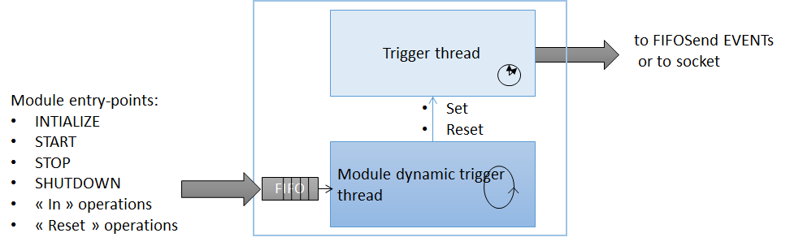


##### 2.2.2.2 LDP Inter-processes communication

All communications between processes are made with TCP or UDP networking protocol. 
Consequently, ECOA messages between 2 modules in 2 different Protection Domains are sent with TCP/UDP. 
Messages between the main process and Protection Domain processes are also sent with TCP/UDP.

The main process is connected with all child processes (all Protection Domains). 
Protection Domains are connected with some Protection Domains regarding wires described in XML files: one wire between two Components in different Protection Domain is represented by one IP connection.

The implementation of the Main-process and the router-thread for TCP or UDP have a lot of differences. 
For TCP, a mechanism for connection and reconnection is implemented. That is useless for UDP (UDP is connectionless). 
The functions prototypes for inter-process communication are the same for TCP or UDP protocol but the implementation is completely different.

Note: The choice of the protocol is made at compilation. Only the used source files will be compiled.

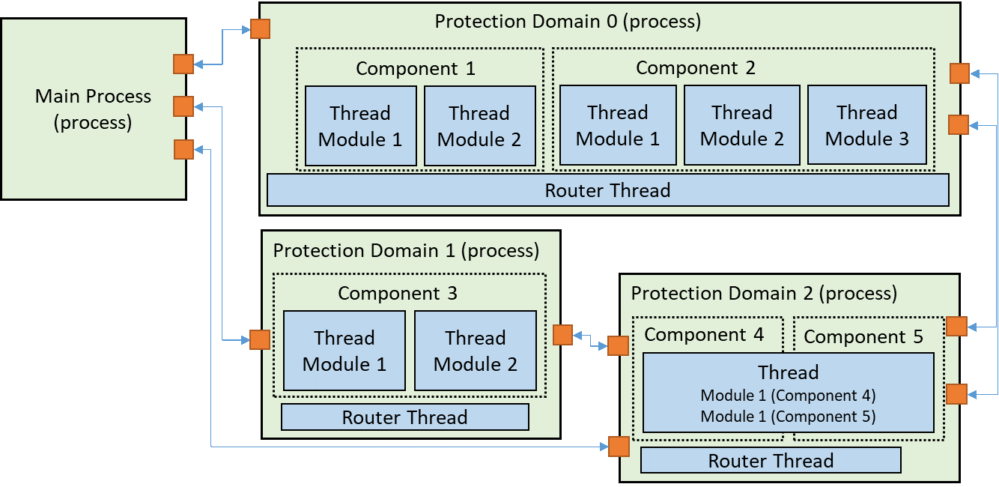

The figure above displays three protection domains. The wires represent the IP communication between each of them. 
Protection domain 2 represents a dedicated thread executing multiple grouped modules (see Optional Module Mapping). 
Those grouped modules can be from the same or different components.
Modules from the same Protection Domain are not communicating through IP connection.

###### 2.2.2.2.1 Application network frame

Frame of a message between two processes always starts by a flag of 4 bytes (0xECOA). By this way, it is possible to detect and correct read error on sockets. 
Currently, only error detection is implemented. Every message is constructed as below:

|0|4|8|16|32|64|96|
|:---:|:---:|:---:|:---:|:---:|:---:|:---:|
|0xE|0xC|0x0|0xA|Parameter size|Operation ID|Parameters|

For Request-response messages, a sequence number is added before the message. 
This number is used to retrieve the sender module and route the response to it.

|0|4|8|16|32|64|96|128|
|:---:|:---:|:---:|:---:|:---:|:---:|:---:|:---|
|0xE|0xC|0x0|0xA|Sequence number|Parameter size|Operation ID|Parameters|

With TCP protocol, the message is sent without specific application header knowing that the protocol guarantees the arrival of the complete message.
With UDP protocol, it is necessary to cut long message in several packets and to add a header on each packet to enable the receiver to re-build the message. (More details in §UDP)

Note: for communication inside a Platform (i.e.: not for ELI), messages are not serialized. Consequently, sender and receiver must have the same Endianness property. 

It could be a problem if sender and receiver are not on the same physical computer.

###### 2.2.2.2.2 TCP

With the TCP protocol, the server-side is the Protection Domain with the Component that provides services, and the client-side is the other one.

A TCP connection has a specific port. On server-side, the server has a connection socket that is used only to (re-)connect with client. 
The communication is made on the communication socket. The client has only a communication socket.

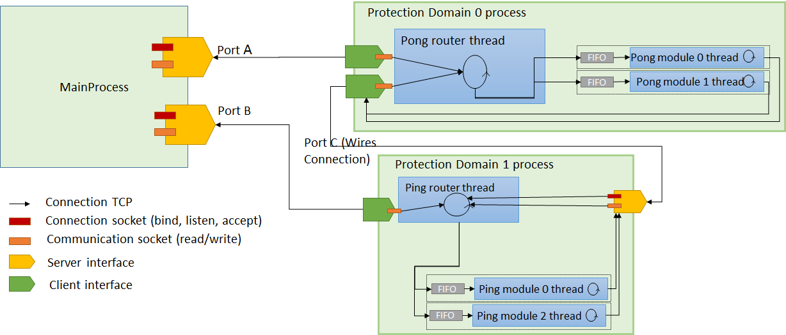

The previous figure shows a simple example with 2 components in 2 different Protection Domains. 
The 2 components are connected by one wire. This wire is implemented as a TCP connection on the port C.

**Connection/Reconnection behavior**

The main process and the router-threads have the same structure. But the main process is more specific. 

The router function listens for incoming messages on a list of sockets, reads these messages and routes messages to FIFO module or consumes them if they are platform messages. 

To listen socket, router and main processes use a poll of file descriptors.
At the start of the router-thread, the connection with the main process is already established. 

Connections with other Protection Domains need to be established:

- For server connections, server sockets are created and listen for a new connection. Server sockets are added to the poll of file descriptor.
- For client connections, a list of unconnected interfaces contains all the connections to establish with a server. The router-thread tries to establish every connection and removes the interface from the list of unconnected interfaces when the connection is established. 

When a connection is established, the communication socket is added to the poll of file descriptor.

The router thread or main process starts to listen to the poll of file descriptors. In case of event on a file descriptor, it could be:

- A new connection if it is a connection socket: in this case, the client is accepted; a communication socket is created, and a file descriptor is added to the poll.
- A message on a socket: the message is read and routed.
- A closed socket event: attached file descriptor is removed. 
	- If it is a client disconnection, the communication socket is removed.
	- If it is a server disconnection, the interface is added to the list of unconnected interfaces.
	- Periodically, router thread tries to reconnect interface with server.

###### 2.2.2.2.3 UDP

In UDP, there is no need of connection between sockets. Unlike TCP, an UDP link is symmetrical. 
It is much simpler: there is neither client nor server. A "UDP interface" is composed of a read socket and a write socket. 

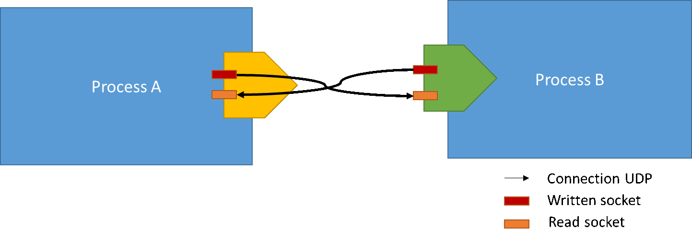

**Send on a UDP socket**

To send messages on UDP socket, messages should not be too big. Big messages are fragmented in packets. Packets are sent on the socket and the receiver needs to re-build the completed messages thanks to information in the packet header. The header of an UDP packet is composed of:

- An ID of message to make a difference between packets from different messages. ID is an increased number. It could be used to compare ages of 2 messages.
- The byte number in the completed message the start of the data. It is used to reconstruct completed message if packets arrive disorderly. 
- The size of data
- The number of packets that should be received to completed message

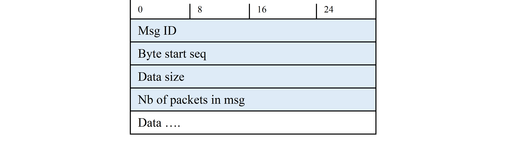

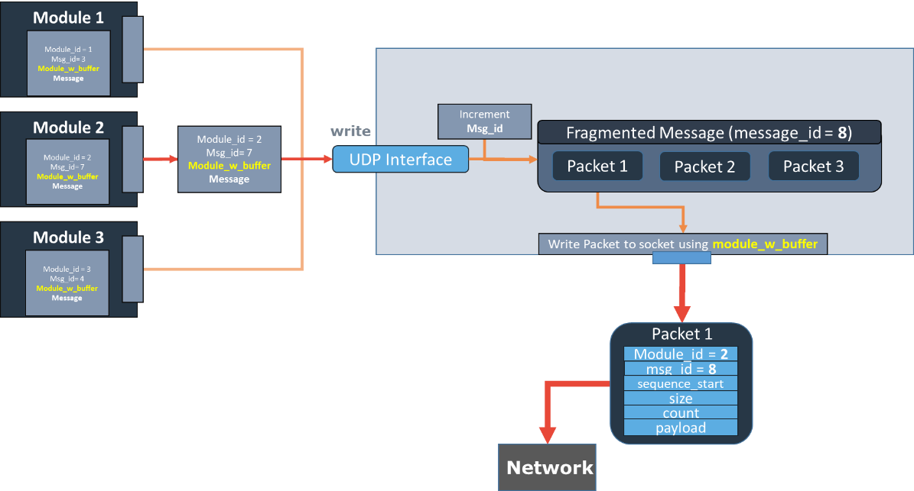

**Read on a UDP socket**

The read must re-build message and reorder received packets. Currently, the receiver can wait only for one uncompleted message at a time and accepts only the most recent message. 

- All packets with the same ID are saved in a buffer and reordered when all packets from a same message identifier are received.
- When a packet with a greater ID arrives / is received, the previous packets are discarded (the current uncompleted message becomes obsolete).
- When a packet with a lower ID (lower than the current processed message) is received, the packet is discarded (packet is too old).

Consequently, the loss of one packet leads to the removal of the incomplete message. 
Congestion on the read socket can lead to the loss of a lot of messages. 
There is no mechanism allowing the resent of a lost packet.

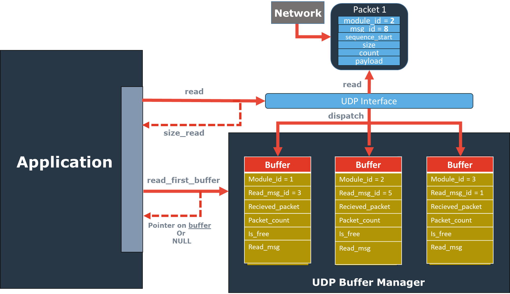

##### 2.2.2.3 LDP Platform startup

###### 2.2.2.3.1 Platform creation and establishing connections

At platform startup, the main process creates sockets and starts other processes. Then it waits for new connections. 

###### 2.2.2.3.2 Protection Domain router thread details

The router thread is the main thread of a Protection Domain process. 

It is started at the beginning to create Module threads and make TCP/UDP connections. 

But after the start of a platform, its role is to route messages from sockets to Module FIFO and to make TCP reconnection.

At startup, the router thread aims at:

- Creating component context which contains module contexts.
- Initializing data structure (like logger, external Versioned Data manager)
- Creating module threads
- Creating sockets
- Start router function

At last, the router server is started. 

###### 2.2.2.3.3 Starting ECOA modules

When the main process has received notification from all the Protections Domains that servers' threads are running. 

The main server notifies router-threads to initialize all modules. 

Route-threads send INITIALIZE events to all modules regarding ECOA order: Trigger modules, dynamic trigger modules, and then other modules. 

The last module of a Protection Domain that finishes to consume these events notify the main process.

The main process received notification from all Protection Domains that all modules are in READY state. 
Then the main process notifies router-threads to start all modules. 
Router-threads send START to all modules regarding ECOA order. 
Then module threads consume this event and change module state to RUNNING.

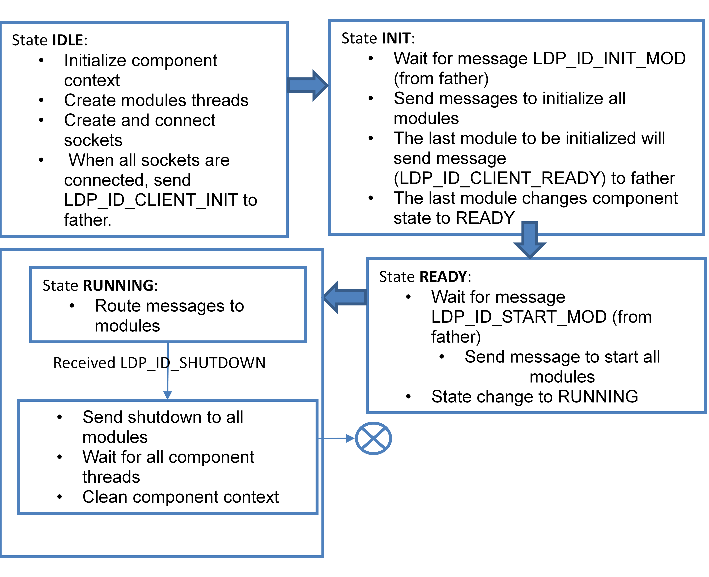

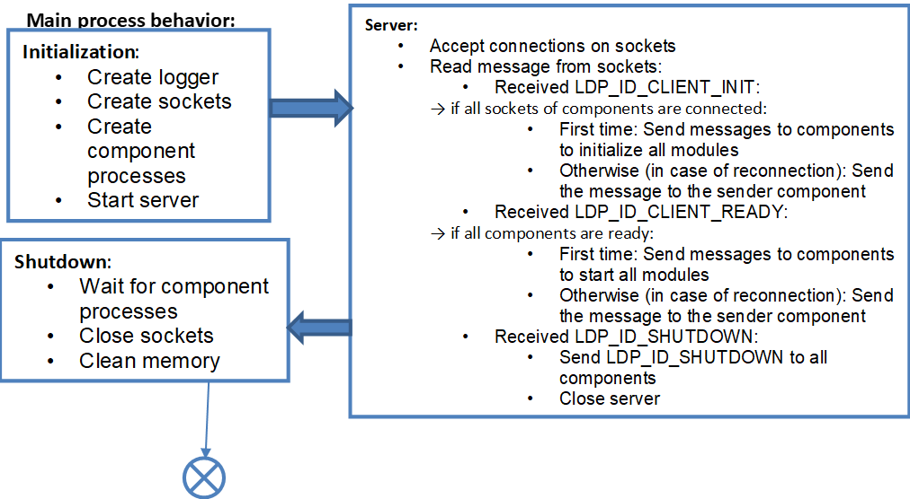

##### 2.2.2.4 LDP Module operations

###### 2.2.2.4.1 Send Operation

**Operation Map**

When an ECOA module calls a function in its container to send an
operation (event, request-response or versioned data), the function
uses an `operation_map` structure to retrieve receiver information for
this operation. An operation map contains:

- The list of local module contexts which receive this operation
- The list of sockets (in platform) which send message to other protection domains
- The list of ELI socket which send message to other ECOA platform

For each receiver modules, some information is necessary:

- The operation ID in the receiver module,
- The operation index to find the element pool (see FIFO manager) which handle operation.
- Information about activating property of this operation
- Information about the answer of this operation for Asynchronous Request-Response only

For each socket (ELI or not), same information is necessary except the
activating property of the operation. This information is known by the
router of the receiver Protection Domain.

**Sending Message**

To send an operation, module container uses `msg_buffer` to write parameters.
For local message (local receiver modules and same platform sockets),
parameters are not serialized. They are just copied in buffer with the
right index.

For socket messages, a header is added (see §network frame).

For ELI message between Platforms, the ELI header is added at the beginning of the message.

For local module receiver, operation is directly push in FIFO using FIFO manager of the receiver.

**Send an Event Operation**

Event operation are broadcast to every receiver module, local sockets and ELI sockets of the operation map. 

**Send Request-Response**

For a Request-Response, if the operation map has more than one receiver, the request is sent only one time to the first receiver in this order:

- first local module
- first local socket
- first ELI socket

To send a Request Response, module container has to:

- Check if the maximum number of concurrent operations is not reached for this operation
- Save information about the sent request in `request_response` structure

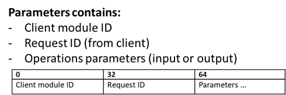

- For asynchronous Request-Response: set trigger to retrieved timeout Request-Response
- If server is a module: 
	- Save information about the `request_received` in `request_response` structure of the server module
	- push message in FIFO module, copy parameter
- If server is socket: send message with `sequence_number` (= ID of the sender module)
	- If server is an ELI socket, `sequence_number` and parameter must be serialized before sending.

In case of synchronous Request-Response, client module waits on a thread condition (with a timeout). 

The client is unlocked by either an answer or a timeout. When the
condition is satisfied without being triggered by the timeout, the
answer will be located on the top of the FIFO.

For asynchronous Request-Response, a special thread can push invalid answers to client FIFO in case of timeout.

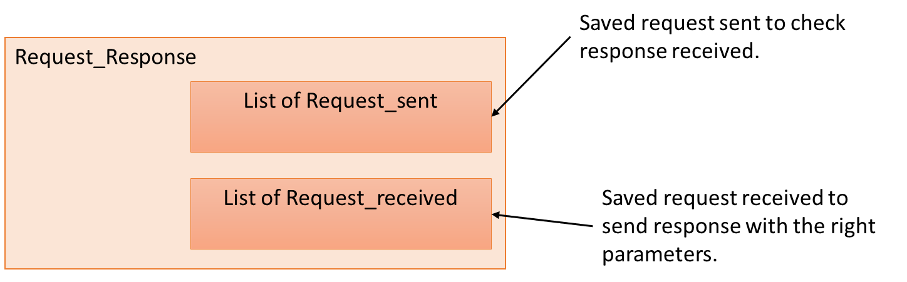

**Send Request-Response answer**

For a response of a Request-Response, the sender is retrieved thanks
to information saved in the `request_received` structure (created when
the request has been received). The sender could be a module, a local
socket or an ELI socket.

For module, answer is pushed directly in the FIFO manager. For
synchronous answer, the operation is pushed in the first place and the
receiver module is unlocked by sending signal with the POSIX
condition.

For socket, Header and `sequence_number` are added to the message before sending.

For ELI socket, information must be serialized.

###### 2.2.2.4.2 FIFO Manager

The FIFO manager is an abstract structure to push and pop elements
to/from a module FIFO. It contains structures to handle operations and
parameters. FIFO manager controls the maximum number of operation that
a FIFO can contain. The FIFO manager authorizes or not module to pop
an element from FIFO according to the number of activating operations
in FIFO.

A FIFO manager is composed of:

- A FIFO
- A mutex to protect concurrent accesses
- A thread condition to block/unblock the module thread if it tries to pop an element operation
- An Integer that represents the current number of pending activating operations in FIFO
- An array of element pool that contains FIFO element for each type of
  operation. The pool with index 0 is reserved for platform and
  lifecycle operations. The other pools are created regarding the
  possible operation that the module can received: one pool for each
  type of operation. In each pool, elements are sized to handle
  parameters of operation


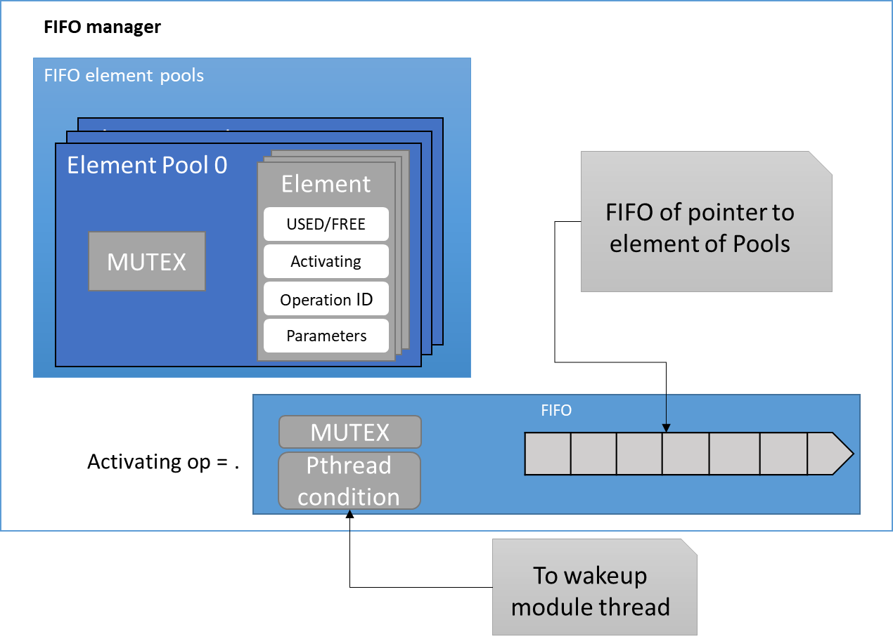

**Pushing elements in FIFO**

A Module A (or the router thread) wants to push an operation **op_C** in the FIFO of a Module B of the same component. To push an element, the Module A (or router thread) needs to know:

- The index of the operation **op_C** in the FIFO manager of the module B to get the element pool. 
- The operation ID of **op_C** in Module B
- If the operation is activating or not-activating

Module A gets an element from the right pool. The get operation is
thread-safe. The element is tagged as "USED" to enable Module A
writing operation information inside (operation ID, activating
operation, parameters, and parameter size).


Then Module A pushes the element in FIFO (also thread-safe). The FIFO manager:

- Push the new operation **op_C** in FIFO
- Update the current number of pending activating operation. If this
  number is greater than zero, the FIFO manager signals the Module B
  using a POSIX signal to the thread condition.


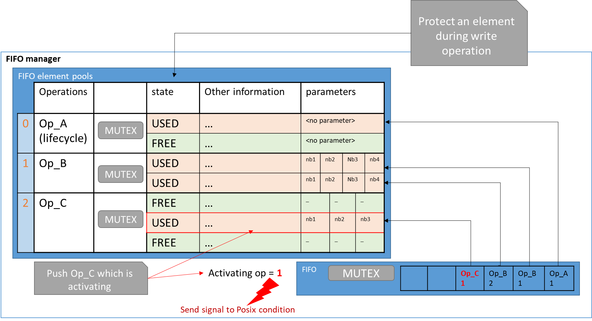

The previous figure shows an example of the FIFO Manager of module B When **op_C** is pushed.

**Popping elements from FIFO**

The module B waits on a thread condition for the FIFO manager to
enable to pop element. When it is possible, Module B pops an
element. The FIFO manager updates the current number of activating
operations pending in FIFO (if it is an activating operation).

When Module B consumes popped element, the element is released in the right element pool. It is tagged as "FREE".

###### 2.2.2.4.3 Driver API

A non ECOA module can push Event operations in an ECOA Module using a generated driver API. 

To implement that, the component context of the target module is saved as a global variable. 

Functions in the Driver API can access the target FIFO module using the global variable of component context. 

Driver API function push operation directly in FIFO exactly like a normal module.

###### 2.2.2.4.4 Pinfo manager

In "Normal" Module context, a Pinfo manager is created. This structure
manages all accesses to Pinfo files that the Module can have. A Pinfo
manager structure contains:

- The number of Pinfo
- An array of `Pinfo_structure` for each Pinfo handled by the Module. `Pinfo_structure` contains:
	- The file name of the Pinfo (absolute path)
	- The stream

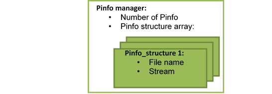

###### 2.2.2.4.5 Versioned Data repository

**Architecture**

In a Protection Domain, if a module has an operation on Versioned Data (read or written), the Protection Domain handle this Versioned Data in a structure (Versioned Data Repository). This structure contains among other:

- An array of copy of the Versioned Data
- The list of the Readers of this Versioned Data that must be notified or updated after publication of data
- A pointer to the function that serializes a Versioned data in a message which is sent outside the Platform.
- A pointer to retrieve the last published Versioned Data in the array of copy

The design and the algorithm allow parallel reading or writing without blocking on a memory copy operation.

Note: Due to the ECOA standard, Protection Domains must be isolated in memory. Consequently, shared memory cannot be easily used to implement Versioned Data.


Module container accesses the Versioned data repository as a Reader or a Writer using specific manager:

- Reader manager contains read accesses as copy of the data
- Writer manager contains write access as pointer to copy of data in the repository structure

Note: in the ECOA standard, Readers can locally modify a Versioned Data. But the data in the repository must remain intact. 

Thus, a read access to a Versioned Data is a copy of the data.  To avoid copying repository during a read access, the Reader could access directly the last published Versioned Data. 

But nothing could prevent the Reader from modifying the data. 

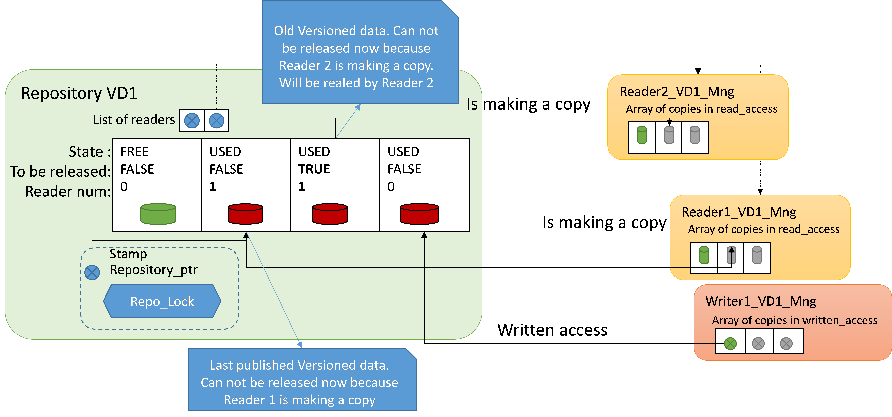

**Publication and notification mechanism**

When a Writer has published data, it must notify local Readers modules and updated data of external Readers. Those Readers can be:

- A local module (in the same Protection Domain) that should receive a notification message.
- Another repository (in the Protection Domain) that should be update directly. The Writer writes the new data directly in the other repository.
- A local socket, if the Reader is in another Protection Domain on the same Platform. The Writer sends messages containing the new data on the socket.
- An external socket connected with another Platform. The Writer sends messages containing the new data on the socket using ELI protocol.

**Optimization of repository number**

In some case, it is possible to reduce the number of Versioned Data Repository in a Protection Domain. 
Some Versioned Data Repositories in the same Protection Domain can be merged. 

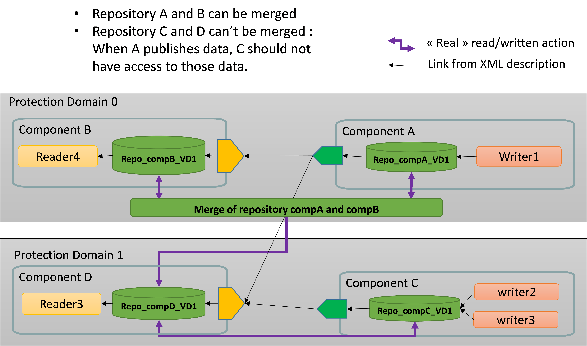

##### 2.2.2.5 LDP Platform logger

To log technical or ECOA messages, LDP Platform can either use:

- zlog. Messages are written in specific text files:
	- One file for logs of the main process
	- For each Protection domains: 
		- One file for technical logs (i.e., from the platform)
		- One file for module logs (i.e., logs with ECOA module container API)
- LTTNG is a C/C++ Framework for Linux only. LTTNG writes user or kernel logs that are written in CTF format. LDP platform uses LTTNG daemon with a session named **Session_ECOA**.
- Console is the standard output.

It is possible to choose one solution at compilation by using a cmake variable. Log messages are written using ECOA format in files.


##### 2.2.2.6 LDP Inter-platform communication (ELI)

**Implementation**

ELI communications are only available using the UDP binding describes
in the annex A of ECOA AS Part 6 ELI. 

ELI messages are processed as inter-process messages but with special header. ELI messages can be sent by any modules or router-thread. 

ELI messages are received, routed, or consumed by the router-thread.

Endianness is supported for ELI messages only (not for communication inside a Platform). 

Message data (payload and headers) is converted in network-byte-order if necessary.

Note: A part of the ELI implementation has been written to be used as a library by another platform. 


**UDP network architecture**

ELI network architecture uses UDP sockets in multicast. A couple multicast address and port represent an end of a Platform Link. 

Those information come from the binding XML files.

The main process is connected to every Platform Links using two sockets (one to read, one to write). 

The main process manages the ELI startup sequence.

Router-thread of each Protection Domain is only connected to every Platform Links that need to be connected regarding Component Wires. 

Router-thread also has two sockets per Platform Links to read or to write messages. 

ELI messages work exactly like inter-process messages on the same Platform but with an ELI header. 

The router-thread reads ELI messages on read sockets. Then it checks if messages are relevant for the Protection Domain and correct. 

Finally, it routes ELI messages to the right module(s). Modules can send ELI messages using the same sending sockets of the router-thread.

1) UDP Channel ID

As every module thread could send ELI messages, modules must use different UDP channel ID. 

Modules use their module ID. Router-thread uses its Protection Domain ID. Main process uses a channel ID equals to zero.

Consequently, on a Platform:

- Protection Domain IDs and Module IDs must be unique. 
- The number of module and Protection Domains connected to the same Platform Link cannot be greater than 255 (because the maximum number of channels on a Platform Link is 256)

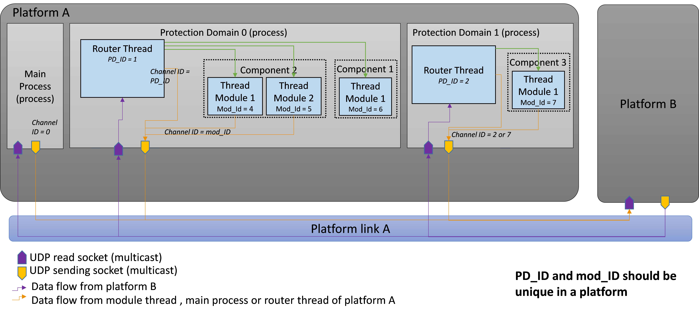

The previous figure shows an example of the ELI network architecture for one Platform Link.

2) Useless Messages

The ELI network architecture has been designed to be efficient by avoiding centralizing the reception of messages in one instance. Unfortunately, this design increases the rate of useless messages. Because of multicast option, any message that is transmitted on a Platform Link is received by all router-threads which are connected on this Platform Link. 

Moreover, if some Platform Links have the same binding, any router-threads connected to one of these Platform Links receive all messages that is transmitted on one of those Links.

Then, lots of messages are discarded at different levels:

- When UDP header is read, if the UDP Platform ID is unknown
- When the ELI header is read, if the Platform ID is equal to the current Platform ID
- If the operation ID of the message is unknown in the Protection Domain


**Startup sequence**

The ELI startup sequence is made by the Main Process when all connections in Protection Domains are created (i.e.: all Protection Domains are in state READY). 

Router-threads read messages about Versioned Data. 

Router-threads also answer to Versioned Data pull request by sending the last published Versioned Data to requesting Platform

##### 2.2.2.7 LDP Fault Handler

The Fault Handler is a mechanism that allows the infrastructure to raise errors detected at different levels (Component, Protection Domain, Computing Platform).

That mechanism allows also recovery actions for errors detected at Protection Domain level (SHUTDOWN and COLD RESTART).

**Overall schema**

LDP Fault Handler mechanism is illustrated hereafter:


**Error exchange**

The errors are sent to the main process using sockets.

When the Fault handler receives an error, it calls the error
notification function (`<platform_name>__error_notification`). 

The content of the error notification function is implemented by the
user. Within the given implementation, regarding the error type
received, the user can decide to either called a recovery action or do
nothing. 

By default, the error notification function is initially empty, therefore no recovery action is performed.


**Signal**

When a Protection Domain crashes, the corresponding signal is caught by the main process.

The error notification function is then called, and its behavior is identical to the error handling.

**Table of errors managed by the fault handler**

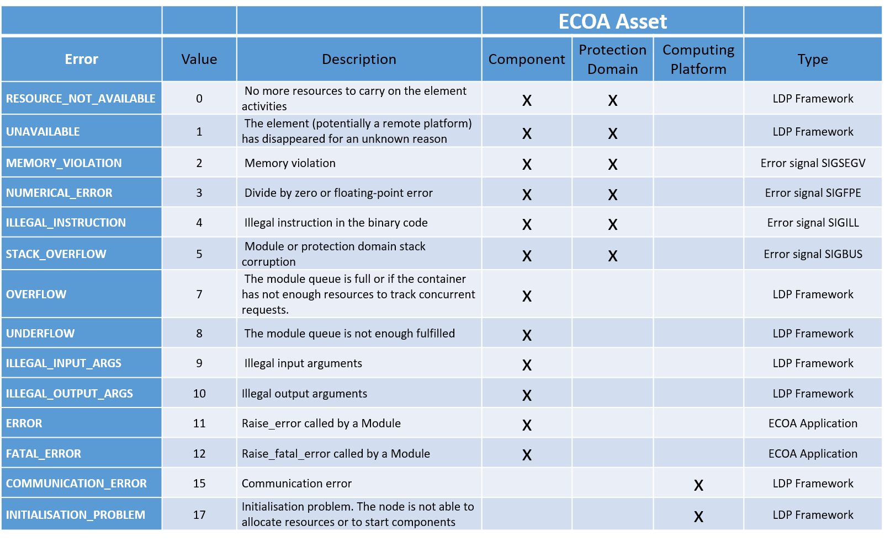

**Error notification API**

Source file:

The error notification source file path is:
`<app_name>/5-Integration/src/<platform_name>_fault_handler.c`

It contains the implementation of the
`<platform_name>__error_notification` function following the prototype
given by ECOA standard:

```C
void <platform_name>__error_notification (
  ldp_fault_handler_context* context, 
  ECOA__error_id error_id,
  ECOA__global_time timestamp,
  ECOA__asset_id asset_id,
  ECOA__asset_type asset_type,
  ECOA__error_type error_type,
  ECOA__uint32 error_code)
{
/* Implementation */
}
```

The implementation of this function provides the way to define the
Fault Handler recovery policy dedicated to the application. Parameters
are detailed by ECOA standard.


`Error_code`:

The error notification API provides an additional parameter: error_code.
This parameter is used to help determining where the error has occurred.

For each occurrence of an `error_type` in the code, a value of
`error_code` is provided, so every time an `error_type` trace is
logged, it allows to identify where it is coming from.


As an example, let's look at the following log:

```
"1627467299,677227060":1:"INFO":"main_PD":"main_node":"[MAIN] Fault
Handler NOTIFICATION: [1627467299:677207363] error_id=0 asset_id=2
asset_type=0 error_type=0 error_code=15"
```

We can now determine that this error has an `error_type` of `RESOURCE_NOT_AVAILABLE (id=0)` and is associated to `error_code` `15`.


## 3.Description of the error management principles

- Detection of errors in tool launching command (wrong or missing argument) with a dedicated message in the user console
- Detection of errors during ECOA input model checking (EXVT displays error messages in the user console)

There are no other robustness treatments in tools implementation.

## 4. Software quality aspect of tool parts

### 4.1 Coding rules

PEP8 for Python

Basic SonarQube set of rules for C and C++

### 4.2 Coverage mode

The coverage mode can be enabled, in MSCIGT and CSMGVT, while the compilation of the code and measures of how many lines, or blocks of code are tested using a suite of automated tests. 

The coverage is measured in percentage: the closer it is to 100%, the better. The coverage mode will generate a `coverage.info` file.

`LCOV` is the tool used to have a graphical interface of the coverage, it creates HTLM pages containing the source code annotated with coverage information.

### 4.3 Profiling mode

The profiling mode can be enabled in MSCIGT and CSMGVT in code compiling directives. 

Profiling allows to identify which parts of the code is slower in
execution than expected, and provide statistics through which many
potential bugs can be located and sorted out.

Once compiled, the code will produce a profiling data `gmon.out`.

`GPROF` is the tool used to run the executable with `gmon.out` as an argument. 
It produces an analysis file which contains all the desired profiling information.
